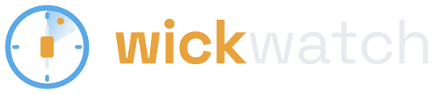
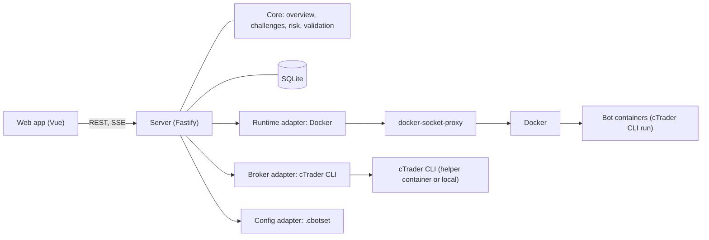

<p align="center">
  
</p>

**wickwatch** is a self-hosted dashboard to monitor and control trading bots: see what runs where and with which parameters, start and stop instances, follow positions and deals live, and keep prop-firm challenge limits in view.

> **Status:** early development, used on demo and prop-challenge accounts. Phase 1 of the [roadmap](docs/ROADMAP.md) is built and in trial operation: wickwatch runs cTrader bots in Docker containers through the cTrader CLI, reads accounts, positions and deals, and can stop everything on an account.

## Try it
wickwatch starts with a **demo adapter**: fake accounts, instances, positions and logs, so you can look around without a broker or bots.

With Docker:

```sh
docker run --rm -p 3000:3000 -e MASTER_KEY="$(openssl rand -base64 32)" -v wickwatch-data:/app/data ghcr.io/wickwatch/wickwatch:0.4.1
```

To build the image yourself instead: `docker build -t wickwatch .` and run `wickwatch` in place of the image name.

Or from source (Node 24+, pnpm):

```sh
pnpm install
cp .env.example .env    # then set MASTER_KEY=$(openssl rand -base64 32) in .env
pnpm start
```

Then:
1. Copy the **setup token** from the log line `No admin yet. Open /setup and enter the setup token: …`.
2. Open http://localhost:3000, enter the token, a user name and a password.
3. Scan the QR code with an authenticator app (e.g. 2FAS, Aegis, Google Authenticator) and enter the code, or skip two-factor authentication and set it up later under *Profile*. The overview with demo data opens.

How to use it: [`docs/USER-GUIDE.md`](docs/USER-GUIDE.md). Running real bots and deploying behind a reverse proxy: [`deploy/README.md`](deploy/README.md), step by step on a Linux server: [`deploy/INSTALL.md`](deploy/INSTALL.md). All settings: [`docs/CONFIGURATION.md`](docs/CONFIGURATION.md). AI clients: [`docs/MCP.md`](docs/MCP.md). The API is described with OpenAPI: [`docs/openapi.json`](docs/openapi.json) in the repo, interactive docs at `/api/docs` after login.

## Features
- **Overview:** accounts with balance, equity, today's P&L, open positions and pending orders; all instances with status, uptime, positions, today's P&L and the last log line; alerts for stopped, crashed or disconnected bots, broker errors and challenge limits.
- **Instances:** start, stop, restart; create, edit, duplicate and delete bots from an uploaded algo, with a form generated from the algo's parameters. Load parameters from a `.cbotset` file or download them as one. Every save is a version; older versions can be restored. Parameter templates keep named parameter sets of an algo and apply them to any of its instances, on any account or timeframe. An optional account size check warns when the capital a bot calculates with is far off the account's.
- **Instance detail:** key figures, realised P&L curve (7, 30, 90 days or all), live log, open positions, pending orders and trade history with risk in % and R per trade; a details panel per position, order and trade.
- **Accounts:** broker logins stored encrypted, an account page with all its bots, positions and orders, and an **emergency stop** that stops the account's bots, cancels its orders and closes its positions (with confirmation, audit-logged).
- **Prop challenges:** a profile per account with profit target, daily loss (reset time and zone, balance or equity), max drawdown (static, trailing, or trailing on the end-of-day balance), minimum trading days and duration. Templates for FTMO and The Trading Pit. An optional **loss guard** runs the emergency stop when a limit is nearly used up.
- **API and MCP:** REST API with OpenAPI docs, API tokens for scripts, and a read-only MCP endpoint so AI clients can read accounts, instances, logs and alerts.
- **Operations:** built-in login with optional two-factor authentication and read-only users, audit log, bots started again after a host or Docker restart, webhook and heartbeat notifications, backups and data retention, host status.
- Dark and light mode, English and German, usable on a phone.
- Deploy standalone, behind nginx-proxy, Traefik or any reverse proxy.

## Architecture
A strategy- and broker-neutral core talks to pluggable adapters. Docker is reached only through a docker-socket-proxy that allows the few API calls wickwatch needs.



| Adapter | First implementation |
| --- | --- |
| Runtime (run, stop, logs) | Docker |
| Broker (accounts, positions, deals, metadata, trading actions) | cTrader CLI |
| Config (parameter files) | `.cbotset` |

Every adapter also has a demo implementation with fake data. See [`docs/ROADMAP.md`](docs/ROADMAP.md) and [`docs/ADAPTERS.md`](docs/ADAPTERS.md). Security model: [`SECURITY.md`](SECURITY.md).

## About the name
A *wick* is the thin line above and below a candlestick that shows how far price moved. *wickwatch* keeps watch over your trading bots, down to every wick.

## Contributing
Contributions are welcome, see [`CONTRIBUTING.md`](CONTRIBUTING.md). Commits must be signed off (DCO).

## Support

wickwatch is a hobby project. If it helps you, you can support it on [Ko-fi](https://ko-fi.com/mmohrx) or through [GitHub Sponsors](https://github.com/sponsors/mmohrx). The dashboard's footer links there too; `SUPPORT_URL=off` hides the link.

## Disclaimer
wickwatch is a monitoring and control tool, not financial advice. Trading involves risk; you are responsible for your bots and accounts. cTrader is a trademark of its respective owner; wickwatch is not affiliated with or endorsed by Spotware.

## License
[AGPL-3.0](LICENSE)
